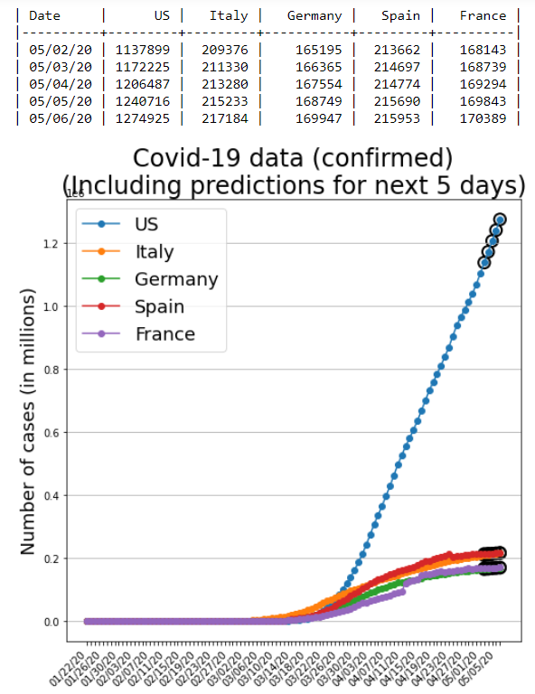
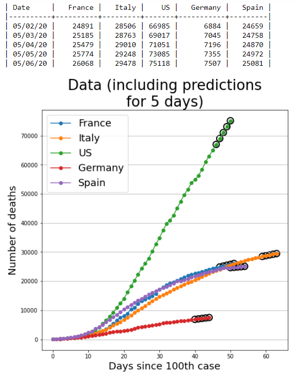

# Time Series Analysis of covid-19 data

### (Epidemiological analysis is in the pipeline)

## Snapshot of short-term predictions

#### Number of confirmed cases by country (including predictions for next 5 days)
{:height="50%" width="50%"}

#### Number of deaths by country (including predictions for next 5 days)
{:height="50%" width="50%"}

## Data

Data for all countries are taken from https://github.com/CSSEGISandData/COVID-19/tree/master/csse_covid_19_data
Data for all US states are taken from https://covidtracking.com/us-daily/
