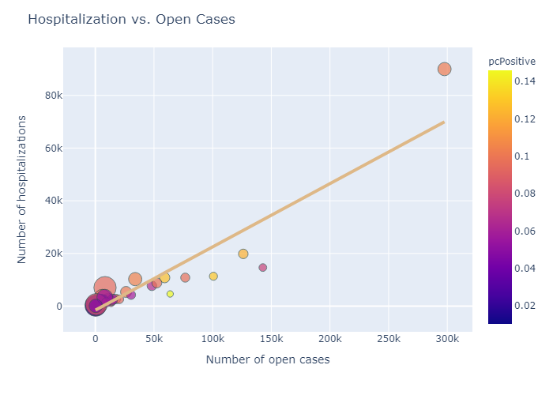

# Time Series Analysis of covid-19 data

### (Epidemiological analysis is in the pipeline)

## Snapshot of short-term predictions

#### Number of confirmed cases by country (including predictions for next 5 days)

#### Number of deaths by country (including predictions for next 5 days)

#### Number of confirmed cases by US states (including predictions for next 5 days)

#### Number of deaths by US states (including predictions for next 5 days)

#### Relationship of hospitalization vs. open cases by US states (Interactive plot: screenshots/hospitalizationVsOpenCases_USStates.html)
#### (color bar indicates percentage of tested people appearing positive)
#### (size of marker indicates percentage of hospitalized patients out of positive tests)

## Comments

Although countries like Italy, Germany, France, and Spain seem to be reaching a plateau, the curve for US indicates that it is not yet close to a plateau, both in terms of number of cases as well as in terms of number of deaths.

## Data

Data for all countries are taken from https://github.com/CSSEGISandData/COVID-19/tree/master/csse_covid_19_data
Data for all US states are taken from https://covidtracking.com/us-daily/
